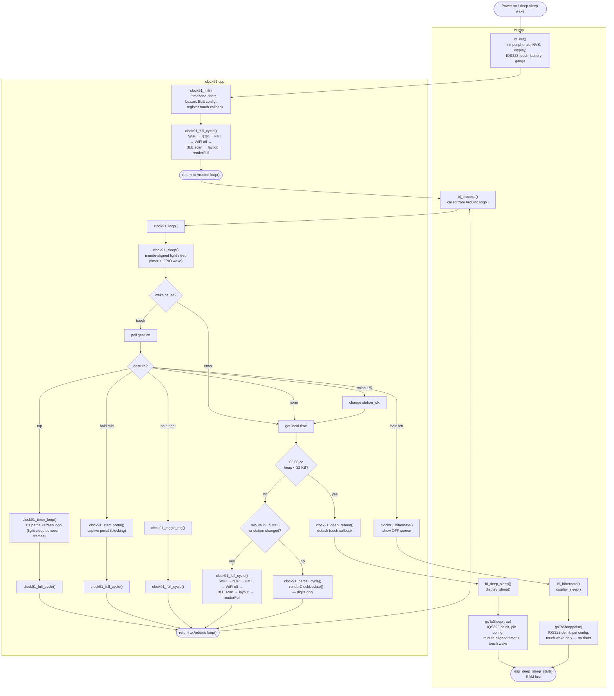

# clock91 — F-91W Clock & Marine Dashboard

Custom firmware for the TRMNL X e-ink display. Combines an F-91W–style digital clock with a marine/environmental dashboard showing BLE sensor data (Victron energy, Ruuvi tags), FMI weather observations and forecasts, sunset-based alarm, and a countdown timer with coffee-cup animation.

No server, no cloud, no mode switching. One screen shows everything.

## Design principles

- Single screen, all data visible at a glance
- FMI weather station as the location primitive (25 Finnish coastal stations compiled in)
- Battery-first power design (light sleep between 60 s wake cycles)
- Finland-only: Europe/Helsinki timezone, FMI stations hardcoded
- Custom firmware on open-source hardware (GPLv3)

---

## Hardware

| Parameter | Value |
|---|---|
| Display | 10.3", 1872×1404 px, e-paper (1-bit partial, 16-level greyscale full) |
| Partial refresh | ≤ 200 ms |
| Full refresh | ≤ 1.2 s |
| MCU (main) | ESP32-S3, 16 MB flash, 8 MB PSRAM |
| MCU (Wi-Fi) | ESP32-C5 (2.4/5 GHz dual-band, managed by upstream firmware) |
| BLE | BLE 5.0 (via ESP32-S3, NimBLE stack) |
| Battery | 6000 mAh Li-ion, TI BQ27427 fuel gauge |
| Touch | IQS323 3-channel capacitive touch bar |
| Buzzer | SparkFun Qwiic Buzzer (I2C 0x34) via Qwiic connector — optional |

---

## UX & gestures

The IQS323 touch bar has three capacitive channels (left, middle, right) and recognises swipe, flick, tap, and hold gestures. The device has two interactive states: **normal mode** and **timer mode**.

### Normal mode

The default state. The device sleeps between minute-aligned wake cycles and updates the display.

| Gesture | Action | What happens |
|---|---|---|
| Swipe/flick left | Previous station | Saves index to NVS, runs full cycle with new station |
| Swipe/flick right | Next station | Saves index to NVS, runs full cycle with new station |
| Tap | Start timer | Enters timer mode (always starts at 2:00) |
| Hold left (CH0) | Power off | Shows "OFF" screen, enters deep sleep — touch to wake |
| Hold middle (CH1) | Setup | Opens captive portal for WiFi + BLE config |
| Hold right (CH2) | USB OTG toggle | Switches USB power direction, refreshes display |

The status bar at the bottom of the screen labels the three hold zones:

```
[ OFF ]              [ SETUP ]              USB Power: Out
  CH0                  CH1                       CH2
```

### Timer mode

Entered by tap gesture. The display switches to a split layout: clock area (top-left), coffee cup with animated steam (top-right), countdown digits and progress bar (bottom half). The screen refreshes every second via partial update.

| Gesture | Action |
|---|---|
| Tap | Cancel timer, return to normal mode |
| Swipe/flick right | Next preset, restart countdown |
| Swipe/flick left | Previous preset, restart countdown |

Timer presets cycle through: **2:00 → 3:00 → 4:00 → 5:00 → 1:00**.

On completion the buzzer plays a melody, then the device returns to normal mode with a full cycle.

### Station selection

25 Finnish coastal and reference stations compiled in `stations.h`. Each station defines: name, FMI station ID, latitude, longitude, and wave buoy flag. Current index saved to NVS as `station_idx` and persists across reboots.

### Alarm

Display-only indicator, no audible alarm. Rule: 1 minute before sunset or 20:59, whichever is earlier. Sunset calculated from station coordinates using NOAA solar equations.

### Hibernate & wake

Hold-left puts the device into deep sleep with no timer wake — it stays off (e-ink retains last image) until any touch gesture wakes it. On wake the device boots fresh with a full cycle.

---

## Build & flash

PlatformIO (ESP-IDF + Arduino framework). All commands from `trmnl-firmware/`.

```bash
# Development build (serial debug, no light sleep)
pio run -e local_x

# Run native tests
pio test -e native -v

# Upload to device (USB-C, device in flash mode)
pio run -e local_x -t upload

# Serial monitor
pio device monitor
```

### Build environments

| Environment | Board | CLOCK91_MODE | Light sleep | BLE/Buzzer | Use |
|---|---|---|---|---|---|
| `local_x` | ESP32-S3 | yes | disabled | yes | Development + flash |
| `TRMNL_X` | ESP32-S3 | no | n/a | no | Upstream TRMNL firmware |
| `native` | Host | n/a | n/a | n/a | Unit tests (g++/gcc) |

`CLOCK91_MODE` is set via `-D CLOCK91_MODE=1` build flag in `platformio.ini`. A production environment (with light sleep enabled and BLE/buzzer libs) is not yet defined — `local_x` with `DO_NOT_LIGHT_SLEEP` removed would serve.

---

## Architecture

### Entry points

clock91 integrates into the upstream TRMNL firmware via `#ifdef CLOCK91_MODE` guards in `bl.cpp`:

```
bl_init()  →  clock91_init()  →  clock91_full_cycle()  →  return
bl_process()  →  clock91_loop()  →  return  (called repeatedly from Arduino loop())
```

`clock91_init()` runs once: sets timezone, loads fonts, initializes buzzer and BLE config, registers touch callback, runs the first full cycle.

`clock91_loop()` runs on every Arduino `loop()` iteration: sleeps until next minute, handles wake cause, dispatches gestures, runs full or partial cycle.

### Control flow



### Sleep modes

| Function | Sleep type | Timer wake | Touch wake | RAM | Use case |
|---|---|---|---|---|---|
| `clock91_sleep()` | Light sleep | yes (minute-aligned) | yes (GPIO) | preserved | Normal 60 s cycle |
| `bl_deep_sleep()` | Deep sleep | yes (minute-aligned) | yes (EXT0) | lost | Nightly reboot (03:00) or low heap |
| `bl_hibernate()` | Deep sleep | no | yes (EXT0) | lost | Power-off gesture (hold left) |

Both deep sleep functions call `goToSleep(bool enable_timer)` in `bl.cpp` which handles IQS323 deinit, pin configuration, and sleep entry.

### Heap management

Light sleep preserves all RAM, so heap fragmentation from Arduino `String` and `HTTPClient` allocations accumulates across wake cycles. Mitigations:

1. **Nightly deep sleep reboot** at 03:00 — full deep sleep with timer wake. Device restarts in ~60 s with a clean heap. E-ink retains the last image.
2. **Emergency reboot** if `esp_get_free_heap_size()` drops below 32 KB.
3. **Heap watermark logging** — every wake cycle logs free heap and all-time minimum via serial.

### Rendering pipeline

Display updates use a DrawList abstraction:

```
DisplayState (all data fields) → buildLayout() → DrawList (up to 200 DrawCmds) → renderDrawList()
```

`DrawCmd` supports three types: `DRAW_TEXT` (font + position), `DRAW_LINE` (with thickness), `DRAW_RECT_FILL`. Fonts are Group5-compressed (generated from TTF via bb_epaper's fontconvert).

| Font ID | Typeface | Size | Use |
|---|---|---|---|
| `FONT_DSEG7_340` | DSEG7 Classic Bold | 340 px | Clock HH:MM, timer M:SS |
| `FONT_DSEG7_72` | DSEG7 Classic | 72 px | Data values, date, alarm |
| `FONT_DSEG7_22` | DSEG7 Classic | 22 px | Forecast grid cells |
| `FONT_DSEG14_72` | DSEG14 Classic | 72 px | Day-of-week, station name |
| `FONT_UBUNTU_22` | Ubuntu | 22 px | Labels, units |

Refresh strategy:
- **Partial cycle** (every minute): `renderClockUpdate()` — row-limited partial refresh of clock digits only (rows ~170–550)
- **Full cycle** (every 15 min, station change, post-timer/portal): `renderFull()` — full e-ink refresh, clears ghosting
- **Timer mode**: full-screen partial refresh every second (clock + coffee cup steam animation + countdown)

---

## Display layout

1872×1404 px, landscape orientation. Divided into zones by structural lines:

```
┌────────────────────────────┬───────────────────┐
│  CLOCK AREA                │  ELECTRICALS      │  y=0
│  Day-of-week   Date        │  SOLAR     xxx W  │
│                             │  AC        xxx W  │
│     HH : MM                │  HOUSE     xxx W  │
│                             │  BATTERY   xx %   │
│  ALARM  HH:MM              │  ENGINE    xx.x V │
│                             │  DEVICE    xx %   │
├────────────────────────────┼───────────────────┤  y=680
│  FMI                       │  RUUVI            │
│  Station Name              │  SALOON   xx.x °C │
│  WIND    xx.x m/s          │           xx.x %  │
│  GUST    xx.x m/s          │  ICEBOX   xx.x °C │
│  DIR      xxx °            │                   │
├─────────────┬──────────────┴───────────────────┤  y=1024
│  FORECAST (24 columns × 5 rows)                │
│  OBS 4×1h │ FC 4×1h │ FC 8×2h │ FC 8×4h       │
│  HOUR  WIND  GUST  DIR  SEA                    │
├────────────────────────────────────────────────┤  y=~1370
│  [ OFF ]      [ SETUP ]      USB Power: Out    │  status bar
└────────────────────────────────────────────────┘  y=1404
         x=1275 (vertical split, top half only)
```

Timer mode replaces electricals with a coffee cup (RLE-compressed 1BPP bitmap with 3-frame steam animation) and adds a countdown below the mid-line:

```
┌────────────────────────────┬───────────────────┐
│  CLOCK AREA (unchanged)    │  ☕ COFFEE CUP    │
│                             │  (animated steam) │
├────────────────────────────┴───────────────────┤  y=680
│              M : SS                             │
│         ██████████████░░░░░░░ progress bar      │
└────────────────────────────────────────────────┘
```

---

## Data sources

### BLE — Victron energy devices

Three device slots, each configured via captive portal with MAC address + AES encryption key:

| Slot | NVS keys | Struct | Key fields |
|---|---|---|---|
| Solar (SmartSolar) | `v_solar_mac`, `v_solar_key` | `VictronSolar` | pv_power, battery_voltage, battery_current, charger_state |
| Shunt (SmartShunt) | `v_shunt_mac`, `v_shunt_key` | `VictronShunt` | battery_voltage, battery_current, soc, aux_voltage |
| VE.Bus (MultiPlus) | `v_vebus_mac`, `v_vebus_key` | `VictronVEBus` | battery_voltage, battery_current, ac_in_power, ac_out_power |

Decryption uses AES-128-CTR via mbedtls (bundled with Arduino-ESP32). BLE scanning uses NimBLE passive scan with manufacturer ID filtering (0x02E1 = Victron) and bitmask-based early stop.

Energy flow calculation:
- **SOLAR**: PV input power from SmartSolar
- **AC**: battery power from VE.Bus (positive = shore charging, negative = inverting)
- **HOUSE**: computed as `shunt_power - solar_battery_power - vebus_power`
- **BATTERY**: state of charge % from SmartShunt
- **ENGINE**: auxiliary/starter battery voltage from SmartShunt

### BLE — Ruuvi environmental tags

Two device slots, configured via captive portal with MAC address (no encryption):

| Slot | NVS key | Fields |
|---|---|---|
| Saloon | `ruuvi_0_mac` | temperature, humidity |
| Icebox | `ruuvi_1_mac` | temperature |

RAWv2 format parsing (manufacturer ID 0x0499).

### FMI open data

Three HTTP queries per 15-minute cycle, to `https://opendata.fmi.fi/wfs`:

| Query | Stored query ID | Parameters | Result |
|---|---|---|---|
| Observations | `fmi::observations::weather::simple` | fmisid, 6 params (t2m, ws_10min, wg_pt10m_max, wd_10min, rh, p_sea) | Wind speed, gust, direction |
| Wind forecast | `fmi::forecast::harmonie::surface::point::simple` | latlon, WindSpeedMS/WindGust/WindDirection, timestep=60 | Hourly wind for ~66 h |
| Sea level | `fmi::forecast::oaas::sealevel::point::simple` | fmisid, SeaLevel | Hourly sea level forecast |

Forecast data is aggregated into a 24-column grid: 4 observation columns (past 4h, 1h each) + 4 forecast columns (1h each) + 8 forecast columns (2h each) + 8 forecast columns (4h each) = 52 hours forward.

### NTP

Time synced via `time.google.com` and `time.cloudflare.com`. Timezone hardcoded to `EET-2EEST,M3.5.0/3,M10.5.0/4` (Europe/Helsinki).

### Sunset & alarm

Sunset calculated using NOAA solar equations (`calculateSunTimes()` in `sunset.h`). Returns UTC fractional hours, converted to local time.

Alarm rule: 1 minute before sunset or 20:59, whichever is earlier. Display-only — no audible alarm (buzzer reserved for timer).

---

## Configuration

### Captive portal

Triggered by hold-middle gesture. Starts an AP named "TRMNL" and serves:
- WiFi configuration (upstream TRMNL portal)
- BLE device configuration at `/clock91/config` — MAC addresses and Victron AES keys for 3 Victron slots + 2 Ruuvi slots

After portal closes, BLE config is reloaded from NVS and a full cycle runs.

---

## Error handling

Errors are handled silently — failed data sources show dashes on screen:
- **WiFi failure**: skip NTP + FMI, proceed with stale time and BLE data
- **FMI failure**: retain NAN values, rendered as `--` dashes
- **BLE failure**: no devices heard = NAN values = dashes
- **NTP failure**: display shows whatever `time(NULL)` returns (may be stale from last sync)

No retry counters or backoff. Failed sources are re-attempted on the next 15-minute cycle.

---

## Testing

17 test suites run on the `native` environment (host g++/gcc, Unity framework):

| Suite | Tests |
|---|---|
| test_alarm | Alarm calculation (sunset, edge cases) |
| test_fmi_parse | FMI XML observation/forecast parsing |
| test_forecast | Forecast grid aggregation |
| test_format | Number/value formatting |
| test_layout | DrawList generation, status bar, data rows |
| test_ruuvi | Ruuvi RAWv2 parsing |
| test_sunset | NOAA sunset calculation |
| test_timer | Timer state machine, presets |
| test_victron | Victron Solar/Shunt/VE.Bus BLE decryption + parsing |

Upstream test suites (test_bmp, test_parse_api_display, test_parse_api_setup, test_png_flip, test_serialize_api_log, test_serialize_log, test_stored_logs, test_string_utils) are retained.

```bash
pio test -e native -v
```

---

## Project structure

```
src/
├── clock91.cpp          Main app: init, loop, sleep, gestures, full/partial cycle
├── render.cpp           E-paper rendering: DrawList → framebuffer → refresh
├── ble_scan.cpp         NimBLE scanning: Victron + Ruuvi, config from NVS
├── fmi_fetch.cpp        FMI HTTP client: observations, wind forecast, sea level
├── buzzer.cpp           Qwiic Buzzer I2C driver: beep, timer melody
├── bl.cpp               Upstream business logic (CLOCK91_MODE guards for integration)
├── main.cpp             Arduino setup()/loop() → bl_init()/bl_process()
└── ...                  Upstream: display.cpp, pins.cpp, api-client/, etc.

include/
├── clock91.h            clock91_init/loop declarations
├── render.h             Render function declarations
├── ble_scan.h           BLE scan interface
├── fmi_fetch.h          FMI fetch interface
├── buzzer.h             Buzzer interface
├── bl.h                 bl_init, bl_process, bl_deep_sleep, bl_hibernate
├── config.h             Board defines, pin mappings, version, preferences keys
├── coffee_cup.h         RLE-compressed coffee cup + steam frame bitmaps
└── fonts/               Group5-compressed font headers (dseg7, dseg14, ubuntu)

lib/trmnl/
├── include/
│   ├── layout.h         DisplayState, DrawCmd, DrawList, LAYOUT_* constants, FontId
│   ├── forecast.h       ForecastGrid, ForecastColumn, aggregation functions
│   ├── victron.h        Victron BLE structs + parsers (Solar, Shunt, VE.Bus)
│   ├── ruuvi.h          Ruuvi RAWv2 struct + parser
│   ├── sunset.h         NOAA sunset calculation
│   ├── alarm.h          Alarm calculation (sunset - 1 min or 20:59)
│   ├── timer.h          Timer state machine, presets
│   ├── format.h         Number formatting for display
│   ├── fmi_parse.h      FMI XML parsing
│   └── stations.h       25 Finnish coastal stations
└── src/
    ├── layout.cpp        Layout builder: zones, data rows, forecast grid, status bar
    ├── forecast.cpp      Forecast aggregation (obs + wind + sea level)
    ├── victron.cpp       Victron AES-CTR decryption + field parsing
    ├── ruuvi.cpp         Ruuvi RAWv2 field extraction
    ├── sunset.cpp        NOAA equations
    ├── alarm.cpp         Alarm logic
    ├── timer.cpp         Timer presets + state transitions
    ├── format.cpp        Value → string formatting
    └── fmi_parse.cpp     Simple XML parser for FMI responses

test/                     17 test suites (Unity framework, native platform)
```

---

## Future work

- **Production build environment**: define a `clock91` env with `CLOCK91_MODE=1`, light sleep enabled, BLE + buzzer libs
- **OTA updates**: adapt upstream OTA infrastructure for clock91 firmware
- **Wave buoy data**: FMI has wave observation data for some stations (`has_wave` flag exists)
- **Power measurement**: validate actual battery life with light sleep (spec estimated ~80 days with deep sleep)
- **Portrait mode**: 1404×1872 orientation for wall mounting
